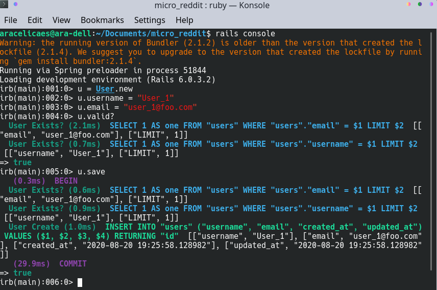

<!-- PROJECT LOGO -->
# Building with Active Record
This Project is a Rails app built using Ruby on Rails, to display the creation and usage of Models.

<!-- TABLE OF CONTENTS -->
## Table of Contents
- [Building with Active Record](#building-with-active-record)
  - [Table of Contents](#table-of-contents)
- [About The Project](#about-the-project)
- [Getting started](#getting-started)
  - [Installation](#installation)
  - [Features:](#features)
- [Authors](#authors)
- [Acknowledgements](#acknowledgements)
  - [Show your support](#show-your-support)
<!-- ABOUT THE PROJECT -->
# About The Project
This Project is a Rails app built using Ruby on Rails, to display the creation and usage of Models. Inside these Models we have created Databases and links through Active Record Associations, Validations and Migrations.

<!-- GETTING STARTED -->
# Getting started
## Installation
* Clone the repo following [this link](https://github.com/aracelicaes/micro_reddit/tree/feature/reddit)
* Install all dependencies running from terminal using the command <pre><code>bundle install
</code></pre>
* Run from terminal <pre><code>bin/rails console
</code></pre>

## Features:
* Ruby 2.7.0
* Rubocop
* Ruby Gems
* Postgresql

<!-- CONTACT -->
# Authors
👤 **Ara Camarillo**

- Github: [aracelicaes](https://github.com/jessicafarias)
- Twitter: [@Ara_CE_93](https://twitter.com/Ara_CE_93)
- Linkedin: [Ara Camarillo](www.linkedin.com/in/ara-camarillo)

👤 **Jessica Farias**

- Github: [jessicafarias](https://github.com/jessicafarias)
- Twitter: [@FariasRosado](https://twitter.com/FariasRosado)
- Linkedin: [jessica-michelle-farias-rosado](https://www.linkedin.com/in/jessica-michelle-farias-rosado/)

* Project Link: [Click Here](https://github.com/aracelicaes/ruby_web_scraper/tree/scraper)
<!-- ACKNOWLEDGEMENTS -->
# Acknowledgements
- [Microverse](https://microverse.org)
- [Best-README-Template](https://github.com/othneildrew/Best-README-Template)
- [Rails Guides](https://guides.rubyonrails.org/)
- [The Odin Project](https://www.theodinproject.com/courses/ruby-on-rails/lessons/building-with-active-record-ruby-on-rails)

## Show your support

Give a ⭐️ if you like this project!
